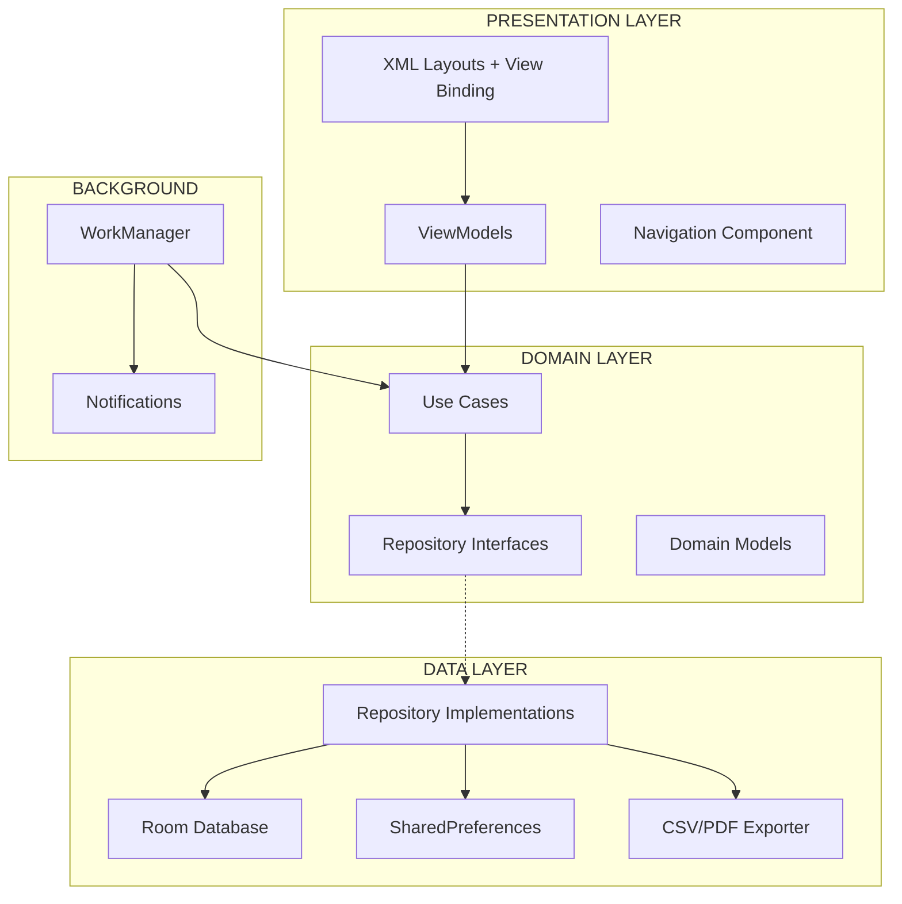
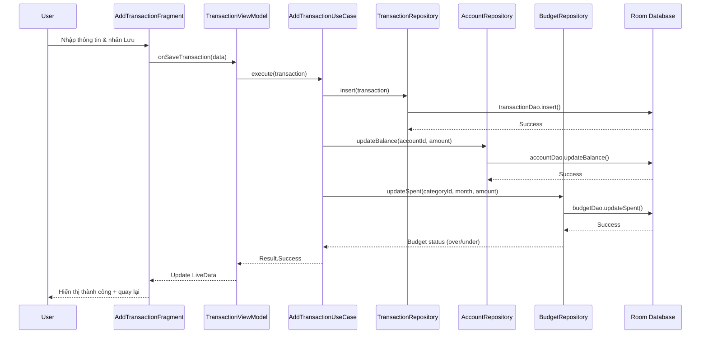
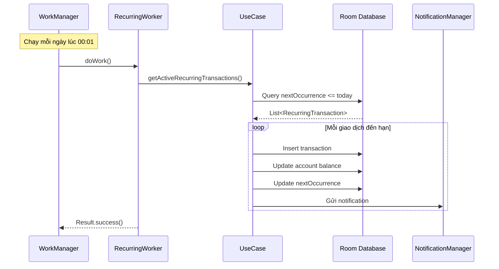
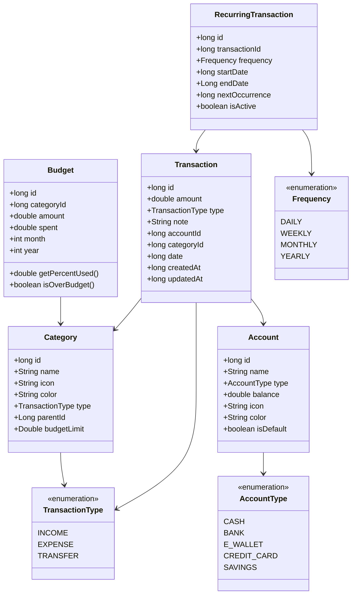

# Thiết Kế Hệ Thống - Ứng Dụng Quản Lý Tài Chính Cá Nhân

## Mục Lục

1. [Tổng Quan Dự Án](#1-tổng-quan-dự-án)
2. [Kiến Trúc Hệ Thống](#2-kiến-trúc-hệ-thống)
3. [Thiết Kế Cơ Sở Dữ Liệu](#3-thiết-kế-cơ-sở-dữ-liệu)
4. [Thiết Kế Giao Diện (UI/UX)](#4-thiết-kế-giao-diện-uiux)
5. [Các Tính Năng Chi Tiết](#5-các-tính-năng-chi-tiết)
6. [Cấu Trúc Thư Mục Dự Án](#6-cấu-trúc-thư-mục-dự-án)
7. [Công Nghệ Sử Dụng](#7-công-nghệ-sử-dụng)
8. [Sơ Đồ Kiến Trúc](#8-sơ-đồ-kiến-trúc)

---

## 1. Tổng Quan Dự Án

### 1.1. Giới Thiệu

**Tên ứng dụng:** MoneyMate - Quản Lý Tài Chính Cá Nhân

**Mô tả:** Ứng dụng Android giúp người dùng theo dõi thu chi, lập ngân sách, phân tích tài chính cá nhân thông qua biểu đồ trực quan. Toàn bộ dữ liệu được lưu trữ cục bộ trên thiết bị, không cần kết nối internet.

**Nền tảng:** Android (API 26+ / Android 8.0 trở lên)

**Ngôn ngữ:** Java (JDK 17)

**Build Configuration:** Kotlin DSL (build.gradle.kts) [Recommended]

**IDE:** Android Studio

### 1.2. Mục Tiêu

| Mục tiêu | Mô tả |
|-----------|--------|
| Dễ sử dụng | Giao diện trực quan, thao tác nhanh gọn |
| Bảo mật | Dữ liệu lưu cục bộ, hỗ trợ khóa ứng dụng bằng PIN/Vân tay |
| Phân tích thông minh | Biểu đồ, báo cáo chi tiết theo thời gian |
| Offline hoàn toàn | Không cần backend, không cần internet |
| Hiệu năng cao | Khởi động nhanh, tiết kiệm pin và bộ nhớ |

### 1.3. Đối Tượng Người Dùng

- Sinh viên muốn quản lý chi tiêu hàng ngày
- Người đi làm muốn theo dõi thu nhập và tiết kiệm
- Bất kỳ ai muốn kiểm soát tài chính cá nhân

### 1.4. Tính Năng Chính

1. **Quản lý giao dịch** - Thêm, sửa, xóa thu/chi
2. **Danh mục** - Phân loại giao dịch theo danh mục tùy chỉnh
3. **Ngân sách** - Đặt hạn mức chi tiêu theo danh mục/tháng
4. **Báo cáo & Biểu đồ** - Thống kê trực quan theo ngày/tuần/tháng/năm
5. **Ví/Tài khoản** - Quản lý nhiều ví (tiền mặt, ngân hàng, ví điện tử)
6. **Nhắc nhở** - Thông báo thanh toán định kỳ
7. **Xuất dữ liệu** - Export ra file CSV/PDF
8. **Bảo mật** - Khóa ứng dụng bằng PIN hoặc sinh trắc học
9. **Giao dịch định kỳ** - Tự động tạo giao dịch lặp lại
10. **Tìm kiếm & Lọc** - Tìm kiếm giao dịch theo nhiều tiêu chí

---

## 2. Kiến Trúc Hệ Thống

### 2.1. Mô Hình Kiến Trúc: MVVM + Clean Architecture

Ứng dụng sử dụng kiến trúc **MVVM (Model-View-ViewModel)** kết hợp với **Clean Architecture** để đảm bảo:
- Tách biệt rõ ràng giữa các tầng (Separation of Concerns)
- Dễ dàng kiểm thử (Testability)
- Dễ bảo trì và mở rộng (Maintainability & Scalability)

### 2.2. Các Tầng Kiến Trúc

```
┌─────────────────────────────────────────────────────┐
│                  PRESENTATION LAYER                   │
│  ┌───────────┐  ┌────────────┐  ┌───────────────┐  │
│  │  Activity  │  │  Fragment  │  │  XML Layout   │  │
│  └─────┬─────┘  └─────┬──────┘  └───────┬───────┘  │
│        │               │                 │           │
│        └───────────────┼─────────────────┘           │
│                        ▼                             │
│              ┌──────────────────┐                    │
│              │    ViewModel     │                    │
│              └────────┬─────────┘                    │
├───────────────────────┼─────────────────────────────┤
│                  DOMAIN LAYER                        │
│              ┌────────▼─────────┐                    │
│              │    Use Cases     │                    │
│              └────────┬─────────┘                    │
│              ┌────────▼─────────┐                    │
│              │   Repository     │                    │
│              │   (Interface)    │                    │
│              └────────┬─────────┘                    │
├───────────────────────┼─────────────────────────────┤
│                   DATA LAYER                         │
│              ┌────────▼─────────┐                    │
│              │  Repository Impl │                    │
│              └────────┬─────────┘                    │
│        ┌──────────────┼──────────────┐              │
│        ▼              ▼              ▼              │
│  ┌──────────┐  ┌───────────┐  ┌──────────────┐    │
│  │ Room DAO │  │SharedPrefs │  │ CSV/PDF      │    │
│  │          │  │            │  │ Exporter     │    │
│  └──────────┘  └───────────┘  └──────────────┘    │
└─────────────────────────────────────────────────────┘
```

### 2.3. Mô Tả Từng Tầng

#### Presentation Layer (Tầng Giao Diện)
| Thành phần | Vai trò |
|------------|---------|
| Activity/Fragment | Chứa UI, nhận sự kiện từ người dùng |
| XML Layouts + View Binding | Xây dựng giao diện với Material Design 3 |
| ViewModel | Giữ trạng thái UI, xử lý logic hiển thị |
| LiveData | Observable data holder, lifecycle-aware |

#### Domain Layer (Tầng Nghiệp Vụ)
| Thành phần | Vai trò |
|------------|---------|
| Use Cases | Chứa logic nghiệp vụ cụ thể (1 use case = 1 hành động) |
| Repository Interface | Định nghĩa contract truy cập dữ liệu |
| Domain Models | Các POJO thuần Java, không phụ thuộc framework |

#### Data Layer (Tầng Dữ Liệu)
| Thành phần | Vai trò |
|------------|---------|
| Repository Implementation | Triển khai cụ thể của Repository Interface |
| Room Database | Lưu trữ dữ liệu cục bộ (SQLite) |
| DAO (Data Access Object) | Truy vấn cơ sở dữ liệu |
| SharedPreferences | Lưu cài đặt người dùng (preferences) |

### 2.4. Luồng Dữ Liệu

```
User Action → UI → ViewModel → Use Case → Repository → Room DB
                                                          │
User sees  ← UI ← ViewModel ← Use Case ← Repository ←───┘
              (LiveData quan sát thay đổi)
```

### 2.5. Dependency Injection

Sử dụng **Hilt (Dagger)** để quản lý dependency injection:
- `@HiltAndroidApp` - Application class
- `@AndroidEntryPoint` - Activity/Fragment
- `@HiltViewModel` - ViewModel (sử dụng với `@Inject` constructor)
- `@Module` + `@Provides` / `@Binds` - Cung cấp dependencies (Database, Repository, UseCase)

---

## 3. Thiết Kế Cơ Sở Dữ Liệu

### 3.1. Công Nghệ: Room Database (SQLite)

Room là thư viện ORM chính thức của Android, cung cấp:
- Kiểm tra truy vấn SQL tại compile-time
- Tích hợp tốt với LiveData để quan sát thay đổi dữ liệu
- Migration dễ dàng khi thay đổi schema

### 3.2. Sơ Đồ Quan Hệ (ERD)

```
┌──────────────┐       ┌──────────────────┐       ┌──────────────┐
│   Account    │       │   Transaction    │       │   Category   │
├──────────────┤       ├──────────────────┤       ├──────────────┤
│ id (PK)      │◄──┐   │ id (PK)          │   ┌──►│ id (PK)      │
│ name         │   │   │ amount           │   │   │ name         │
│ type         │   │   │ type (THU/CHI)   │   │   │ icon         │
│ balance      │   │   │ note             │   │   │ color        │
│ icon         │   └───│ accountId (FK)   │   │   │ type         │
│ color        │       │ categoryId (FK)  │───┘   │ parentId(FK) │
│ isDefault    │       │ date             │       │ budgetLimit  │
│ createdAt    │       │ createdAt        │       │ createdAt    │
└──────────────┘       │ updatedAt        │       └──────────────┘
                       └──────────────────┘
                                │
                                │ (1:1 optional)
                                ▼
                       ┌──────────────────┐
                       │RecurringTransaction│
                       ├──────────────────┤
                       │ id (PK)          │
                       │ transactionId(FK)│
                       │ frequency        │
                       │ startDate        │
                       │ endDate          │
                       │ nextOccurrence   │
                       │ isActive         │
                       └──────────────────┘

┌──────────────┐       ┌──────────────────┐
│    Budget    │       │   Notification   │
├──────────────┤       ├──────────────────┤
│ id (PK)      │       │ id (PK)          │
│ categoryId(FK)│       │ title            │
│ amount       │       │ message          │
│ spent        │       │ type             │
│ month        │       │ scheduledTime    │
│ year         │       │ isRead           │
│ createdAt    │       │ createdAt        │
└──────────────┘       └──────────────────┘
```

### 3.3. Chi Tiết Các Bảng

#### Bảng `accounts` - Tài khoản/Ví

| Cột | Kiểu | Mô tả |
|-----|------|--------|
| id | Long (PK, Auto) | Khóa chính |
| name | String | Tên tài khoản (VD: "Tiền mặt", "Vietcombank") |
| type | Enum | CASH, BANK, E_WALLET, CREDIT_CARD, SAVINGS |
| balance | Double | Số dư hiện tại |
| icon | String | Tên icon hiển thị |
| color | String | Mã màu hex |
| isDefault | Boolean | Tài khoản mặc định |
| createdAt | Long | Timestamp tạo |

#### Bảng `categories` - Danh mục

| Cột | Kiểu | Mô tả |
|-----|------|--------|
| id | Long (PK, Auto) | Khóa chính |
| name | String | Tên danh mục (VD: "Ăn uống", "Di chuyển") |
| icon | String | Tên icon |
| color | String | Mã màu hex |
| type | Enum | INCOME (Thu) / EXPENSE (Chi) |
| parentId | Long (nullable) | ID danh mục cha (hỗ trợ danh mục con) |
| budgetLimit | Double (nullable) | Hạn mức chi tiêu mặc định |
| createdAt | Long | Timestamp tạo |

#### Bảng `transactions` - Giao dịch

| Cột | Kiểu | Mô tả |
|-----|------|--------|
| id | Long (PK, Auto) | Khóa chính |
| amount | Double | Số tiền |
| type | Enum | INCOME (Thu) / EXPENSE (Chi) / TRANSFER (Chuyển khoản) |
| note | String (nullable) | Ghi chú |
| accountId | Long (FK) | Liên kết tài khoản |
| categoryId | Long (FK) | Liên kết danh mục |
| date | Long | Ngày giao dịch (timestamp) |
| createdAt | Long | Timestamp tạo |
| updatedAt | Long | Timestamp cập nhật |

#### Bảng `budgets` - Ngân sách

| Cột | Kiểu | Mô tả |
|-----|------|--------|
| id | Long (PK, Auto) | Khóa chính |
| categoryId | Long (FK) | Liên kết danh mục |
| amount | Double | Hạn mức ngân sách |
| spent | Double | Đã chi tiêu |
| month | Int | Tháng (1-12) |
| year | Int | Năm |
| createdAt | Long | Timestamp tạo |

#### Bảng `recurring_transactions` - Giao dịch định kỳ

| Cột | Kiểu | Mô tả |
|-----|------|--------|
| id | Long (PK, Auto) | Khóa chính |
| transactionId | Long (FK) | Giao dịch mẫu |
| frequency | Enum | DAILY, WEEKLY, MONTHLY, YEARLY |
| startDate | Long | Ngày bắt đầu |
| endDate | Long (nullable) | Ngày kết thúc (null = vô thời hạn) |
| nextOccurrence | Long | Lần tiếp theo |
| isActive | Boolean | Đang hoạt động |

### 3.4. Indexes

```java
@Entity(
    tableName = "transactions",
    indices = {
        @Index(value = {"date"}),
        @Index(value = {"accountId"}),
        @Index(value = {"categoryId"}),
        @Index(value = {"type", "date"})
    }
)
public class TransactionEntity {
    // ...
}
```

### 3.5. SharedPreferences (EncryptedSharedPreferences)

Lưu trữ cài đặt người dùng (không dùng bảng):

| Key | Kiểu | Mô tả |
|-----|------|--------|
| currency | String | Đơn vị tiền tệ (VND, USD...) |
| language | String | Ngôn ngữ (vi, en) |
| theme | String | Giao diện (light, dark, system) |
| pin_code | String | Mã PIN (đã mã hóa) |
| biometric_enabled | boolean | Bật/tắt vân tay |
| first_day_of_week | int | Ngày đầu tuần |
| first_day_of_month | int | Ngày đầu tháng (tính chu kỳ) |
| default_account_id | long | Tài khoản mặc định |

---

## 4. Thiết Kế Giao Diện (UI/UX)

### 4.1. Phong Cách Thiết Kế

- **Design System:** Material Design 3 (Material You)
- **UI Framework:** XML Layouts + View Binding
- **Theme:** Hỗ trợ Dynamic Color (Android 12+), Light/Dark mode
- **Typography:** Roboto / Google Sans
- **Iconography:** Material Icons + Custom SVG icons cho danh mục

### 4.2. Bảng Màu (Color Palette)

```
Primary:        #6750A4 (Tím - chủ đạo)
Secondary:      #625B71
Tertiary:       #7D5260
Background:     #FFFBFE (Light) / #1C1B1F (Dark)
Surface:        #FFFBFE (Light) / #2B2930 (Dark)

Income Color:   #4CAF50 (Xanh lá - Thu nhập)
Expense Color:  #F44336 (Đỏ - Chi tiêu)
Transfer Color: #2196F3 (Xanh dương - Chuyển khoản)
Warning Color:  #FF9800 (Cam - Cảnh báo ngân sách)
```

### 4.3. Cấu Trúc Màn Hình

```
┌─────────────────────────────────────────┐
│              MoneyMate App              │
├─────────────────────────────────────────┤
│                                         │
│  ┌─────┐ ┌─────┐ ┌─────┐ ┌─────────┐  │
│  │Trang│ │Giao │ │Ngân │ │Báo cáo  │  │
│  │chủ  │ │dịch │ │sách │ │         │  │
│  └─────┘ └─────┘ └─────┘ └─────────┘  │
│                                         │
│         Bottom Navigation Bar           │
│  ┌─────┬─────┬─────┬─────┬─────────┐  │
│  │ 🏠  │ 📋  │ ➕  │ 💰  │   📊   │  │
│  │Home │Trans│ Add │Budget│ Report  │  │
│  └─────┴─────┴─────┴─────┴─────────┘  │
└─────────────────────────────────────────┘
```

### 4.4. Chi Tiết Từng Màn Hình

#### 4.4.1. Màn Hình Chính (Home)

```
┌─────────────────────────────────┐
│ MoneyMate          👤 ⚙️        │
├─────────────────────────────────┤
│ ┌─────────────────────────────┐ │
│ │   Tổng số dư                │ │
│ │   12.500.000 ₫              │ │
│ │                             │ │
│ │  ↑ Thu: 15.000.000          │ │
│ │  ↓ Chi:  2.500.000          │ │
│ └─────────────────────────────┘ │
│                                 │
│ ── Giao dịch gần đây ────────  │
│                                 │
│ 📅 Hôm nay                     │
│ ┌─────────────────────────────┐ │
│ │ 🍜 Ăn trưa      -45.000 ₫  │ │
│ │ 🚕 Grab          -32.000 ₫  │ │
│ └─────────────────────────────┘ │
│                                 │
│ 📅 Hôm qua                     │
│ ┌─────────────────────────────┐ │
│ │ 💰 Lương     +15.000.000 ₫  │ │
│ │ ☕ Cà phê       -35.000 ₫  │ │
│ └─────────────────────────────┘ │
│                                 │
│ [🏠] [📋] [➕] [💰] [📊]      │
└─────────────────────────────────┘
```

#### 4.4.2. Màn Hình Thêm Giao Dịch

```
┌─────────────────────────────────┐
│ ← Thêm giao dịch               │
├─────────────────────────────────┤
│                                 │
│  ┌──────┐ ┌──────┐ ┌────────┐  │
│  │ CHI  │ │ THU  │ │CHUYỂN  │  │
│  │(active)│      │ │KHOẢN   │  │
│  └──────┘ └──────┘ └────────┘  │
│                                 │
│  Số tiền:                       │
│  ┌─────────────────────────────┐│
│  │         150.000 ₫           ││
│  └─────────────────────────────┘│
│                                 │
│  Danh mục:    [🍜 Ăn uống    ▼]│
│  Tài khoản:   [💳 Vietcombank ▼]│
│  Ngày:        [📅 20/05/2026  ▼]│
│  Ghi chú:     [Ăn trưa với... ]│
│                                 │
│  ┌─────────────────────────────┐│
│  │         💾 LƯU              ││
│  └─────────────────────────────┘│
│                                 │
└─────────────────────────────────┘
```

#### 4.4.3. Màn Hình Ngân Sách

```
┌─────────────────────────────────┐
│ ← Ngân sách       Tháng 5/2026 │
├─────────────────────────────────┤
│                                 │
│  Tổng ngân sách: 10.000.000 ₫  │
│  Đã chi:          6.200.000 ₫  │
│  Còn lại:         3.800.000 ₫  │
│  ████████████░░░░░░░ 62%        │
│                                 │
│ ── Theo danh mục ────────────── │
│                                 │
│ 🍜 Ăn uống                      │
│ ████████████████░░░ 80%         │
│ 2.400.000 / 3.000.000 ₫        │
│                                 │
│ 🚗 Di chuyển                    │
│ ██████████░░░░░░░░░ 50%         │
│ 1.000.000 / 2.000.000 ₫        │
│                                 │
│ 🛒 Mua sắm                      │
│ ████████████████████ 95% ⚠️     │
│ 1.900.000 / 2.000.000 ₫        │
│                                 │
│ [🏠] [📋] [➕] [💰] [📊]      │
└─────────────────────────────────┘
```

#### 4.4.4. Màn Hình Báo Cáo

```
┌─────────────────────────────────┐
│ ← Báo cáo                      │
├─────────────────────────────────┤
│  [Tuần] [Tháng] [Năm] [Tùy chọn]│
│                                 │
│  ┌─────────────────────────────┐│
│  │     📊 Biểu đồ tròn        ││
│  │                             ││
│  │      ╭───────╮             ││
│  │    ╭─┤Ăn uống├─╮           ││
│  │    │ ╰───────╯ │           ││
│  │    │  38%   25%│           ││
│  │    ╰────────────╯           ││
│  │     20%     17%             ││
│  └─────────────────────────────┘│
│                                 │
│  ── Chi tiết ──────────────────  │
│  🍜 Ăn uống       2.400.000  38%│
│  🚗 Di chuyển     1.600.000  25%│
│  🛒 Mua sắm      1.250.000  20%│
│  🎮 Giải trí     1.050.000  17%│
│                                 │
│  ┌─────────────────────────────┐│
│  │   📈 Biểu đồ xu hướng      ││
│  │   (Thu vs Chi theo tháng)   ││
│  └─────────────────────────────┘│
│                                 │
│ [🏠] [📋] [➕] [💰] [📊]      │
└─────────────────────────────────┘
```

#### 4.4.5. Màn Hình Quản Lý Tài Khoản/Ví

```
┌─────────────────────────────────┐
│ ← Tài khoản                 ➕  │
├─────────────────────────────────┤
│                                 │
│  Tổng tài sản: 25.800.000 ₫    │
│                                 │
│ ┌─────────────────────────────┐ │
│ │ 💵 Tiền mặt                 │ │
│ │    5.200.000 ₫              │ │
│ ├─────────────────────────────┤ │
│ │ 🏦 Vietcombank              │ │
│ │    12.500.000 ₫             │ │
│ ├─────────────────────────────┤ │
│ │ 🏦 Techcombank              │ │
│ │    6.100.000 ₫              │ │
│ ├─────────────────────────────┤ │
│ │ 📱 MoMo                     │ │
│ │    2.000.000 ₫              │ │
│ └─────────────────────────────┘ │
│                                 │
│ [🏠] [📋] [➕] [💰] [📊]      │
└─────────────────────────────────┘
```

### 4.5. Navigation Flow

```
                    ┌──────────┐
                    │  Splash  │
                    │  Screen  │
                    └────┬─────┘
                         │
                    ┌────▼─────┐
                    │PIN/Bio   │ (nếu bật bảo mật)
                    │  Lock    │
                    └────┬─────┘
                         │
              ┌──────────▼──────────┐
              │   Main Navigation   │
              │  (Bottom Nav Bar)   │
              └──────────┬──────────┘
                         │
        ┌────────┬───────┼───────┬──────────┐
        ▼        ▼       ▼       ▼          ▼
    ┌──────┐┌──────┐┌───────┐┌──────┐┌────────┐
    │ Home ││Trans ││Add New││Budget││ Report │
    └──┬───┘└──┬───┘└───────┘└──┬───┘└────────┘
       │       │                 │
       ▼       ▼                 ▼
  Chi tiết  Tìm kiếm      Chi tiết
  giao dịch  & Lọc        ngân sách

  Drawer Menu / Settings:
  ├── Tài khoản/Ví
  ├── Danh mục
  ├── Giao dịch định kỳ
  ├── Xuất dữ liệu
  ├── Cài đặt
  └── Giới thiệu
```

---

## 5. Các Tính Năng Chi Tiết

### 5.1. Quản Lý Giao Dịch

#### Mô tả
Cho phép người dùng ghi nhận mọi khoản thu/chi hàng ngày một cách nhanh chóng.

#### Chức năng
| Chức năng | Mô tả |
|-----------|--------|
| Thêm giao dịch | Nhập số tiền, chọn danh mục, tài khoản, ngày, ghi chú |
| Sửa giao dịch | Chỉnh sửa thông tin giao dịch đã tạo |
| Xóa giao dịch | Xóa với xác nhận, tự động cập nhật số dư |
| Chuyển khoản | Chuyển tiền giữa các tài khoản |
| Tìm kiếm | Tìm theo từ khóa, số tiền, ngày, danh mục |
| Lọc | Lọc theo khoảng thời gian, loại, danh mục, tài khoản |
| Sắp xếp | Theo ngày, số tiền, danh mục |

#### Logic xử lý
```
Khi thêm giao dịch CHI:
  → account.balance -= transaction.amount
  → budget.spent += transaction.amount (nếu có budget cho category)
  → Kiểm tra budget threshold → Gửi notification nếu vượt 80%/100%

Khi thêm giao dịch THU:
  → account.balance += transaction.amount

Khi CHUYỂN KHOẢN:
  → fromAccount.balance -= amount
  → toAccount.balance += amount
```

---

### 5.2. Quản Lý Danh Mục

#### Danh mục mặc định (Pre-populated)

**Chi tiêu (Expense):**
| Icon | Tên | Màu |
|------|-----|-----|
| 🍜 | Ăn uống | #FF5722 |
| 🚗 | Di chuyển | #2196F3 |
| 🛒 | Mua sắm | #9C27B0 |
| 🏠 | Nhà ở | #795548 |
| ⚡ | Hóa đơn & Tiện ích | #FF9800 |
| 🎮 | Giải trí | #E91E63 |
| 📚 | Giáo dục | #3F51B5 |
| 🏥 | Sức khỏe | #4CAF50 |
| 👔 | Quần áo | #607D8B |
| 🎁 | Quà tặng | #F44336 |
| ✈️ | Du lịch | #00BCD4 |
| 📱 | Công nghệ | #455A64 |
| 🐕 | Thú cưng | #8BC34A |
| 💄 | Làm đẹp | #FF4081 |
| 🔧 | Khác | #9E9E9E |

**Thu nhập (Income):**
| Icon | Tên | Màu |
|------|-----|-----|
| 💰 | Lương | #4CAF50 |
| 💵 | Thưởng | #8BC34A |
| 📈 | Đầu tư | #2196F3 |
| 🎓 | Học bổng | #3F51B5 |
| 🏪 | Kinh doanh | #FF9800 |
| 🎁 | Được tặng | #E91E63 |
| 💸 | Thu nhập khác | #9E9E9E |

#### Chức năng
- Thêm/sửa/xóa danh mục tùy chỉnh
- Chọn icon và màu sắc
- Hỗ trợ danh mục con (sub-category)
- Không cho xóa danh mục đang có giao dịch (chỉ ẩn)

---

### 5.3. Quản Lý Ngân Sách

#### Mô tả
Giúp người dùng đặt hạn mức chi tiêu theo từng danh mục trong tháng.

#### Chức năng
| Chức năng | Mô tả |
|-----------|--------|
| Tạo ngân sách | Đặt hạn mức cho danh mục theo tháng |
| Theo dõi | Hiển thị progress bar % đã chi |
| Cảnh báo | Thông báo khi đạt 80% và 100% hạn mức |
| Lịch sử | Xem ngân sách các tháng trước |
| Tổng quan | Tổng ngân sách vs tổng chi tiêu |

#### Quy tắc cảnh báo
```
Nếu spent/amount >= 0.8 (80%):
  → Hiển thị thanh progress màu CAM
  → Gửi notification cảnh báo

Nếu spent/amount >= 1.0 (100%):
  → Hiển thị thanh progress màu ĐỎ
  → Gửi notification "Đã vượt ngân sách!"
```

---

### 5.4. Báo Cáo & Biểu Đồ

#### Các loại biểu đồ

| Loại | Thư viện | Mục đích |
|------|----------|----------|
| Pie Chart | MPAndroidChart | Tỷ lệ chi tiêu theo danh mục |
| Bar Chart | MPAndroidChart | So sánh thu/chi theo thời gian |
| Line Chart | MPAndroidChart | Xu hướng chi tiêu |
| Stacked Bar | MPAndroidChart | Chi tiết danh mục theo tháng |

#### Bộ lọc thời gian
- Hôm nay / Tuần này / Tháng này / Năm nay
- Tùy chọn khoảng thời gian (date range picker)

#### Thống kê hiển thị
- Tổng thu / Tổng chi / Chênh lệch
- Trung bình chi tiêu/ngày
- Danh mục chi nhiều nhất
- So sánh với tháng trước (% tăng/giảm)
- Top 5 giao dịch lớn nhất

---

### 5.5. Giao Dịch Định Kỳ

#### Mô tả
Tự động tạo giao dịch lặp lại theo chu kỳ (tiền nhà, lương, subscription...).

#### Tần suất hỗ trợ
| Tần suất | Ví dụ |
|----------|-------|
| Hàng ngày | Tiền ăn cố định |
| Hàng tuần | Tiền xăng |
| Hàng tháng | Tiền nhà, Netflix, Spotify |
| Hàng năm | Bảo hiểm, gia hạn domain |

#### Cơ chế hoạt động
- Sử dụng **WorkManager** để kiểm tra và tạo giao dịch định kỳ
- Chạy background task mỗi ngày lúc 00:01
- Kiểm tra `nextOccurrence <= today` → Tạo giao dịch → Cập nhật `nextOccurrence`

---

### 5.6. Xuất Dữ Liệu

#### Định dạng hỗ trợ
| Định dạng | Thư viện | Nội dung |
|-----------|----------|----------|
| CSV | Java built-in (OpenCSV) | Danh sách giao dịch dạng bảng |
| PDF | iTextPDF / Android PDF API | Báo cáo có biểu đồ và bảng |

#### Tùy chọn xuất
- Chọn khoảng thời gian
- Chọn tài khoản cụ thể
- Chọn danh mục cụ thể
- Chia sẻ qua Intent (Email, Drive, Zalo...)

---

### 5.7. Bảo Mật

#### Phương thức bảo mật
| Phương thức | Thư viện | Mô tả |
|-------------|----------|--------|
| PIN 4-6 số | Custom | Mã PIN lưu mã hóa trong SharedPreferences |
| Vân tay/Face ID | BiometricPrompt API | Xác thực sinh trắc học |
| Auto-lock | Custom | Tự khóa sau X phút không hoạt động |

#### Bảo mật dữ liệu
- PIN được hash bằng SHA-256 trước khi lưu
- Database có thể mã hóa bằng SQLCipher (tùy chọn nâng cao)
- SharedPreferences mã hóa bằng EncryptedSharedPreferences
- Không lưu dữ liệu nhạy cảm dạng plain text

---

### 5.8. Cài Đặt

| Mục | Tùy chọn |
|-----|----------|
| Đơn vị tiền tệ | VND, USD, EUR... (format hiển thị) |
| Ngôn ngữ | Tiếng Việt, English |
| Giao diện | Sáng / Tối / Theo hệ thống |
| Ngày đầu tháng | 1-28 (để tính chu kỳ lương) |
| Ngày đầu tuần | Thứ 2 / Chủ nhật |
| Thông báo | Bật/tắt nhắc nhở hàng ngày |
| Giờ nhắc nhở | Chọn giờ nhắc ghi chép |
| Bảo mật | PIN / Sinh trắc học |
| Sao lưu | Export/Import database file |
| Xóa dữ liệu | Reset toàn bộ (có xác nhận) |

---

## 6. Cấu Trúc Thư Mục Dự Án

```
app/
├── src/
│   ├── main/
│   │   ├── java/com/moneymate/app/
│   │   │   │
│   │   │   ├── MoneyMateApplication.java         # Application class (@HiltAndroidApp)
│   │   │   │
│   │   │   ├── data/                            # DATA LAYER
│   │   │   │   ├── local/
│   │   │   │   │   ├── database/
│   │   │   │   │   │   ├── AppDatabase.java      # Room Database class
│   │   │   │   │   │   ├── Converters.java       # Type converters
│   │   │   │   │   │   └── dao/
│   │   │   │   │   │       ├── TransactionDao.java
│   │   │   │   │   │       ├── CategoryDao.java
│   │   │   │   │   │       ├── AccountDao.java
│   │   │   │   │   │       ├── BudgetDao.java
│   │   │   │   │   │       └── RecurringTransactionDao.java
│   │   │   │   │   └── preferences/
│   │   │   │   │       └── UserPreferences.java  # SharedPreferences helper
│   │   │   │   │
│   │   │   │   ├── repository/
│   │   │   │   │   ├── TransactionRepositoryImpl.java
│   │   │   │   │   ├── CategoryRepositoryImpl.java
│   │   │   │   │   ├── AccountRepositoryImpl.java
│   │   │   │   │   ├── BudgetRepositoryImpl.java
│   │   │   │   │   └── RecurringTransactionRepositoryImpl.java
│   │   │   │   │
│   │   │   │   └── mapper/
│   │   │   │       ├── TransactionMapper.java    # Entity ↔ Domain mapping
│   │   │   │       ├── CategoryMapper.java
│   │   │   │       └── AccountMapper.java
│   │   │   │
│   │   │   ├── domain/                          # DOMAIN LAYER
│   │   │   │   ├── model/
│   │   │   │   │   ├── Transaction.java
│   │   │   │   │   ├── Category.java
│   │   │   │   │   ├── Account.java
│   │   │   │   │   ├── Budget.java
│   │   │   │   │   ├── RecurringTransaction.java
│   │   │   │   │   └── enums/
│   │   │   │   │       ├── TransactionType.java  # INCOME, EXPENSE, TRANSFER
│   │   │   │   │       ├── AccountType.java      # CASH, BANK, E_WALLET...
│   │   │   │   │       └── Frequency.java        # DAILY, WEEKLY, MONTHLY, YEARLY
│   │   │   │   │
│   │   │   │   ├── repository/
│   │   │   │   │   ├── TransactionRepository.java # Interface
│   │   │   │   │   ├── CategoryRepository.java
│   │   │   │   │   ├── AccountRepository.java
│   │   │   │   │   ├── BudgetRepository.java
│   │   │   │   │   └── RecurringTransactionRepository.java
│   │   │   │   │
│   │   │   │   └── usecase/
│   │   │   │       ├── transaction/
│   │   │   │       │   ├── AddTransactionUseCase.java
│   │   │   │       │   ├── GetTransactionsUseCase.java
│   │   │   │       │   ├── DeleteTransactionUseCase.java
│   │   │   │       │   └── SearchTransactionsUseCase.java
│   │   │   │       ├── category/
│   │   │   │       │   ├── GetCategoriesUseCase.java
│   │   │   │       │   └── ManageCategoryUseCase.java
│   │   │   │       ├── account/
│   │   │   │       │   ├── GetAccountsUseCase.java
│   │   │   │       │   ├── TransferMoneyUseCase.java
│   │   │   │       │   └── ManageAccountUseCase.java
│   │   │   │       ├── budget/
│   │   │   │       │   ├── GetBudgetsUseCase.java
│   │   │   │       │   ├── CheckBudgetAlertUseCase.java
│   │   │   │       │   └── ManageBudgetUseCase.java
│   │   │   │       └── report/
│   │   │   │           ├── GetReportDataUseCase.java
│   │   │   │           └── ExportDataUseCase.java
│   │   │   │
│   │   │   ├── presentation/                    # PRESENTATION LAYER
│   │   │   │   ├── adapter/                     # RecyclerView Adapters
│   │   │   │   │   ├── TransactionAdapter.java
│   │   │   │   │   ├── CategoryAdapter.java
│   │   │   │   │   ├── AccountAdapter.java
│   │   │   │   │   └── BudgetAdapter.java
│   │   │   │   │
│   │   │   │   ├── screen/
│   │   │   │   │   ├── home/
│   │   │   │   │   │   ├── HomeFragment.java
│   │   │   │   │   │   └── HomeViewModel.java
│   │   │   │   │   ├── transaction/
│   │   │   │   │   │   ├── TransactionListFragment.java
│   │   │   │   │   │   ├── AddTransactionFragment.java
│   │   │   │   │   │   ├── TransactionDetailFragment.java
│   │   │   │   │   │   └── TransactionViewModel.java
│   │   │   │   │   ├── budget/
│   │   │   │   │   │   ├── BudgetFragment.java
│   │   │   │   │   │   ├── AddBudgetFragment.java
│   │   │   │   │   │   └── BudgetViewModel.java
│   │   │   │   │   ├── report/
│   │   │   │   │   │   ├── ReportFragment.java
│   │   │   │   │   │   └── ReportViewModel.java
│   │   │   │   │   ├── account/
│   │   │   │   │   │   ├── AccountFragment.java
│   │   │   │   │   │   ├── AddAccountFragment.java
│   │   │   │   │   │   └── AccountViewModel.java
│   │   │   │   │   ├── category/
│   │   │   │   │   │   ├── CategoryFragment.java
│   │   │   │   │   │   ├── AddCategoryFragment.java
│   │   │   │   │   │   └── CategoryViewModel.java
│   │   │   │   │   ├── settings/
│   │   │   │   │   │   ├── SettingsFragment.java
│   │   │   │   │   │   └── SettingsViewModel.java
│   │   │   │   │   └── auth/
│   │   │   │   │       ├── LockFragment.java
│   │   │   │   │       └── AuthViewModel.java
│   │   │   │   │
│   │   │   │   └── MainActivity.java
│   │   │   │
│   │   │   ├── di/                              # DEPENDENCY INJECTION
│   │   │   │   ├── AppModule.java               # Database, SharedPreferences
│   │   │   │   ├── RepositoryModule.java        # Repository bindings
│   │   │   │   └── UseCaseModule.java           # UseCase providers
│   │   │   │
│   │   │   ├── worker/                          # BACKGROUND TASKS
│   │   │   │   ├── RecurringTransactionWorker.java
│   │   │   │   └── ReminderWorker.java
│   │   │   │
│   │   │   └── util/                            # UTILITIES
│   │   │       ├── CurrencyFormatter.java
│   │   │       ├── DateUtils.java
│   │   │       ├── CsvExporter.java
│   │   │       └── Constants.java
│   │   │
│   │   └── res/
│   │       ├── layout/                          # XML Layouts
│   │       │   ├── activity_main.xml
│   │       │   ├── fragment_home.xml
│   │       │   ├── fragment_transaction_list.xml
│   │       │   ├── fragment_add_transaction.xml
│   │       │   ├── fragment_budget.xml
│   │       │   ├── fragment_report.xml
│   │       │   ├── fragment_account.xml
│   │       │   ├── fragment_category.xml
│   │       │   ├── fragment_settings.xml
│   │       │   ├── fragment_lock.xml
│   │       │   ├── item_transaction.xml
│   │       │   ├── item_category.xml
│   │       │   ├── item_account.xml
│   │       │   ├── item_budget.xml
│   │       │   └── dialog_confirm.xml
│   │       ├── navigation/
│   │       │   └── nav_graph.xml                # Navigation Component graph
│   │       ├── menu/
│   │       │   └── bottom_nav_menu.xml
│   │       ├── values/
│   │       │   ├── strings.xml                  # Tiếng Việt (mặc định)
│   │       │   ├── colors.xml
│   │       │   └── themes.xml
│   │       ├── values-en/
│   │       │   └── strings.xml                  # English
│   │       ├── drawable/                        # Icons, illustrations
│   │       └── font/                            # Custom fonts
│   │
│   └── test/                                    # Unit tests
│       └── java/com/moneymate/app/
│           ├── domain/usecase/
│           └── data/repository/
│
├── build.gradle.kts                             # Module-level build (Kotlin DSL)
└── proguard-rules.pro
```

---

## 7. Công Nghệ Sử Dụng

### 7.1. Tech Stack Tổng Quan

| Thành phần | Công nghệ | Phiên bản | Mục đích |
|------------|-----------|-----------|----------|
| Ngôn ngữ | Java | JDK 17 | Ngôn ngữ chính |
| Build Config | Kotlin DSL | build.gradle.kts | Build configuration [Recommended] |
| Min SDK | API 26 | Android 8.0+ | Hỗ trợ ~95% thiết bị |
| Target SDK | API 34 | Android 14 | Tối ưu cho phiên bản mới |
| Build | Gradle KTS | 8.x | Build system |

### 7.2. Android Jetpack Libraries

| Thư viện | Mục đích |
|----------|----------|
| View Binding | Truy cập view an toàn, thay findViewById |
| Material Components 3 | Material Design 3 UI components |
| Navigation Component | Điều hướng giữa các Fragment |
| Room | ORM cho SQLite database |
| SharedPreferences | Lưu trữ cài đặt người dùng |
| ViewModel | Quản lý UI state, survive configuration changes |
| LiveData | Observable data, lifecycle-aware |
| Lifecycle | Quản lý vòng đời component |
| WorkManager | Background tasks (giao dịch định kỳ, nhắc nhở) |
| Hilt | Dependency Injection |

### 7.3. Thư Viện Bên Thứ Ba

| Thư viện | Mục đích | Lý do chọn |
|----------|----------|-------------|
| MPAndroidChart | Biểu đồ (Charts) | Hỗ trợ Java tốt, nhiều loại chart |
| RxJava 3 | Xử lý bất đồng bộ | Reactive programming cho Java |
| iTextPDF (hoặc Android PDF) | Xuất PDF | Tạo báo cáo PDF |
| OpenCSV | Xuất CSV | Đọc/ghi file CSV dễ dàng |
| Lottie | Animation | Splash screen, empty states |
| Glide | Image loading | Load icon, avatar |

### 7.4. Dependencies (build.gradle.kts)

```kotlin
dependencies {
    // Material Design 3
    implementation("com.google.android.material:material:1.11.0")

    // Navigation Component
    implementation("androidx.navigation:navigation-fragment:2.7.7")
    implementation("androidx.navigation:navigation-ui:2.7.7")

    // ViewModel & LiveData
    implementation("androidx.lifecycle:lifecycle-viewmodel:2.7.0")
    implementation("androidx.lifecycle:lifecycle-livedata:2.7.0")

    // Room Database
    val roomVersion = "2.6.1"
    implementation("androidx.room:room-runtime:$roomVersion")
    annotationProcessor("androidx.room:room-compiler:$roomVersion")

    // Hilt DI
    implementation("com.google.dagger:hilt-android:2.50")
    annotationProcessor("com.google.dagger:hilt-compiler:2.50")

    // WorkManager
    implementation("androidx.work:work-runtime:2.9.0")
    implementation("androidx.hilt:hilt-work:1.1.0")
    annotationProcessor("androidx.hilt:hilt-compiler:1.1.0")

    // RxJava 3
    implementation("io.reactivex.rxjava3:rxjava:3.1.8")
    implementation("io.reactivex.rxjava3:rxandroid:3.0.2")
    implementation("androidx.room:room-rxjava3:$roomVersion")

    // Charts - MPAndroidChart
    implementation("com.github.PhilJay:MPAndroidChart:v3.1.0")

    // Biometric
    implementation("androidx.biometric:biometric:1.1.0")

    // Lottie Animation
    implementation("com.airbnb.android:lottie:6.3.0")

    // Splash Screen
    implementation("androidx.core:core-splashscreen:1.0.1")

    // OpenCSV
    implementation("com.opencsv:opencsv:5.9")

    // Glide
    implementation("com.github.bumptech.glide:glide:4.16.0")
    annotationProcessor("com.github.bumptech.glide:compiler:4.16.0")
}
```

### 7.5. Plugins (build.gradle.kts - project level)

```kotlin
plugins {
    id("com.android.application") version "8.2.2"
    id("com.google.dagger.hilt.android") version "2.50"
}
```

### 7.6. Lý Do Chọn Công Nghệ

| Quyết định | Lý do |
|------------|-------|
| XML + View Binding thay Compose | Compose yêu cầu Kotlin; View Binding an toàn, tương thích Java |
| Room thay SQLite trực tiếp | Type-safe, compile-time verification, LiveData/RxJava support |
| Hilt thay manual DI | Compile-time DI, tích hợp tốt với Android components |
| MPAndroidChart thay Vico | Hỗ trợ Java native, nhiều loại biểu đồ, cộng đồng lớn |
| RxJava thay Coroutines | Coroutines là Kotlin-only; RxJava mạnh mẽ cho Java async |
| Navigation Component | Quản lý Fragment navigation an toàn, hỗ trợ Safe Args |
| Kotlin DSL cho build | Autocomplete, type-safe, được Google khuyến nghị |

---

## 8. Sơ Đồ Kiến Trúc

### 8.1. Sơ Đồ Tổng Quan Hệ Thống (Mermaid)



### 8.2. Sơ Đồ Luồng Thêm Giao Dịch



### 8.3. Sơ Đồ Luồng Giao Dịch Định Kỳ



### 8.4. Sơ Đồ Class - Domain Models



### 8.5. Sơ Đồ Module Dependencies

```mermaid
graph LR
    subgraph App
        MAIN[MainActivity]
    end

    subgraph DI["DI Modules"]
        APP_M[AppModule]
        REPO_M[RepositoryModule]
        UC_M[UseCaseModule]
    end

    subgraph Presentation
        HOME_VM[HomeViewModel]
        TRANS_VM[TransactionViewModel]
        BUDGET_VM[BudgetViewModel]
        REPORT_VM[ReportViewModel]
    end

    subgraph Domain
        ADD_UC[AddTransactionUseCase]
        GET_UC[GetTransactionsUseCase]
        BUDGET_UC[GetBudgetsUseCase]
        REPORT_UC[GetReportDataUseCase]
    end

    subgraph Data
        TRANS_REPO[TransactionRepoImpl]
        BUDGET_REPO[BudgetRepoImpl]
        ACCOUNT_REPO[AccountRepoImpl]
    end

    subgraph Local
        DATABASE[(Room DB)]
        PREFS[(SharedPrefs)]
    end

    MAIN --> DI
    DI --> Presentation
    Presentation --> Domain
    Domain --> Data
    Data --> Local
```



---

## 9. Kế Hoạch Phát Triển (Roadmap)

### Phase 1 - MVP (2-3 tuần)
- [x] Thiết kế kiến trúc & database schema
- [ ] Setup project (Hilt, Room, Navigation)
- [ ] Màn hình chính (Home) với tổng quan số dư
- [ ] CRUD giao dịch (thêm/sửa/xóa)
- [ ] Quản lý danh mục cơ bản
- [ ] Quản lý tài khoản/ví

### Phase 2 - Tính Năng Nâng Cao (2 tuần)
- [ ] Ngân sách & cảnh báo
- [ ] Báo cáo & biểu đồ (Pie, Bar, Line)
- [ ] Tìm kiếm & lọc giao dịch
- [ ] Giao dịch định kỳ (WorkManager)

### Phase 3 - Hoàn Thiện (1-2 tuần)
- [ ] Bảo mật (PIN, Biometric)
- [ ] Xuất dữ liệu CSV/PDF
- [ ] Cài đặt & tùy chỉnh
- [ ] Dark mode & Dynamic Color
- [ ] Đa ngôn ngữ (Việt/Anh)
- [ ] Splash screen & onboarding

### Phase 4 - Tối Ưu (1 tuần)
- [ ] Performance optimization
- [ ] UI polish & animations
- [ ] Testing (Unit + UI tests)
- [ ] Bug fixes & edge cases

---

## 10. Tổng Kết

### Điểm Mạnh Của Kiến Trúc

| Tiêu chí | Giải pháp |
|-----------|-----------|
| Offline-first | Room Database + SharedPreferences, không cần internet |
| Hiệu năng | RxJava + LiveData, không block main thread |
| Bảo trì | Clean Architecture, tách biệt rõ ràng các tầng |
| Mở rộng | Use Cases độc lập, dễ thêm tính năng mới |
| UI hiện đại | Material Design 3 + XML Layouts + Dynamic Color |
| Bảo mật | BiometricPrompt + PIN hash + SharedPreferences encrypted |
| Background | WorkManager cho giao dịch định kỳ & nhắc nhở |

### Ước Tính Kích Thước

- **Số file Java:** ~70-90 files
- **Số file XML layout:** ~15-20 files
- **Số màn hình:** 12-15 screens
- **Kích thước APK:** ~10-15 MB
- **Database:** Tùy thuộc dữ liệu người dùng

---

*Tài liệu thiết kế bởi: Senior Architect*
*Ngày tạo: 20/05/2026*
*Phiên bản: 1.0*
